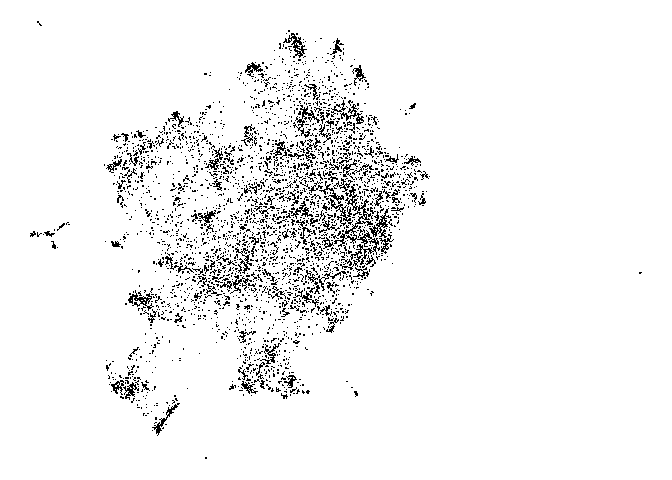

<!-- README.md is generated from README.Rmd. Please edit that file -->

# LandscapeR

<!-- badges: start -->
<!-- badges: end -->


LandscapeR is our R Package for exploring text data which has been
transformed into a navigable landscape. The package makes use of
cutting-edge language models and their dense word embeddings,
dimensionality reduction techniques, clustering and/or topic modelling
as well as Shiny for an interactive data-exploration & cleaning UI.

If the conversation has been mapped appropriately, you will find that
mentions close together in the Shiny application/UMAP plot have similar
meanings, posts far apart have less similar meanings. This makes it
possible to understand and explore thousands, hundreds of thousands, or
even millions of posts at a level which was previously impossible.

## Installation

You can install the development version of LandscapeR using the
`install_github` function from the `devtools` package:

``` r
devtools::install_github(repo = "jpcompartir/LandscapeR")
```

## Example Use Case

We can take this table of text:

``` r
library(LandscapeR)
library(tidyverse)

ls_example 
#> # A tibble: 11,226 × 9
#>    document text      cluster clean_text date                sentiment permalink
#>       <dbl> <chr>       <dbl> <chr>      <dttm>              <chr>     <chr>    
#>  1        1 @Shruthi…       4 shruthio3… 2022-10-26 12:17:22 positive  <a href=…
#>  2        2 anyone u…       2 edge nonw… 2022-10-26 11:44:36 positive  <a href=…
#>  3        3 Non tech…       7 tech peop… 2022-10-26 10:20:16 neutral   <a href=…
#>  4        4 I really…       3 minority … 2022-10-26 06:25:23 positive  <a href=…
#>  5        5 Chrome u…       2 chrome to… 2022-10-26 05:02:06 neutral   <a href=…
#>  6        6 I still …       3 believeha… 2022-10-26 03:16:42 positive  <a href=…
#>  7        7 Try edge…       2 edge rece… 2022-10-26 02:38:57 positive  <a href=…
#>  8        8 telling …       2 telling t… 2022-10-26 01:49:56 positive  <a href=…
#>  9        9 When I m…       7 move ptz … 2022-10-26 01:02:29 negative  <a href=…
#> 10       10 I repent…       4 repent fi… 2022-10-25 23:26:41 positive  <a href=…
#> # ℹ 11,216 more rows
#> # ℹ 2 more variables: V1 <dbl>, V2 <dbl>
```

And transform it into a navigable landscape:

``` r
ls_example %>% ls_plot_static()
```



We can add colour to a grouping variable to see where our groups sit and
how they relate:

``` r
ls_example %>% 
  mutate(cluster = factor(cluster)) %>%
  ls_plot_group_static(group_var = cluster)
```


We can home in on each group:

``` r
ls_example %>%
  mutate(cluster = factor(cluster)) %>%
  ls_plot_group_facet(group_var = cluster)
```


An interesting use case which can be used to inform the LandscapeR
investigative process when comparing two grouping variables, such as
cluster and sentiment, or product and topic etc. is the
`ls_plot_variation_matrix()` function:

``` r
ls_example %>%
  ls_plot_variation_matrix(cluster, sentiment)
#> Loading required namespace: viridis
```


# Shiny Application

For the most up-to-date version of the Shiny application, you should
install the LandscapeRGolem package:

``` r
remotes::install_github(repo = "jpcompartir/LandscaperGolem")
```

Check out the ‘Running Your App Locally’ for tips on how to run the app.
